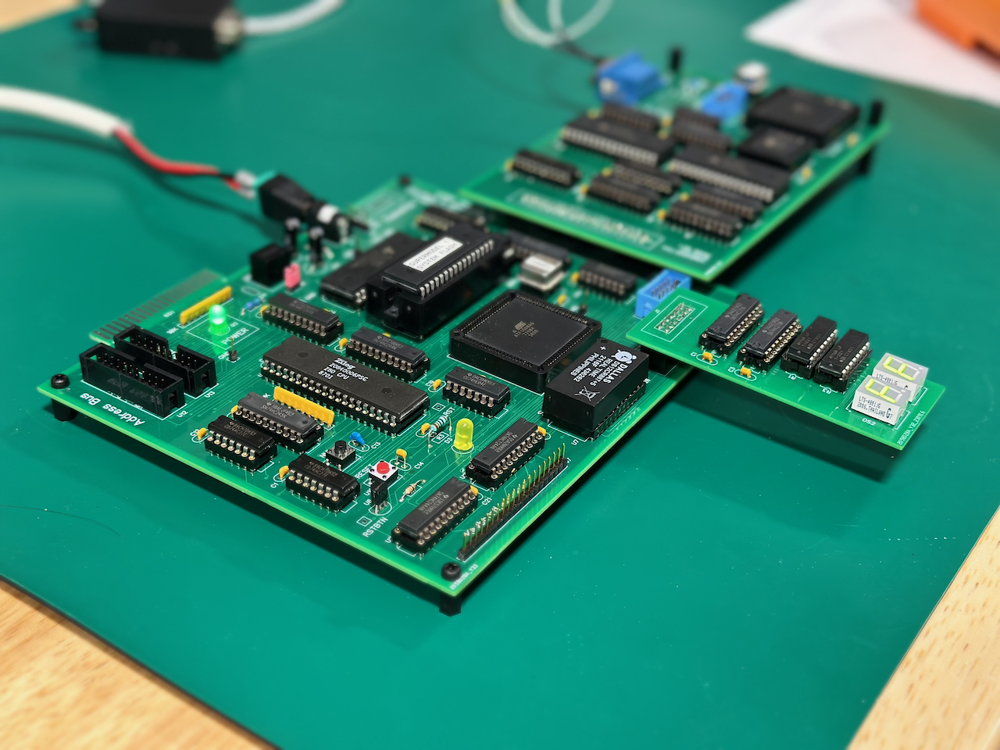
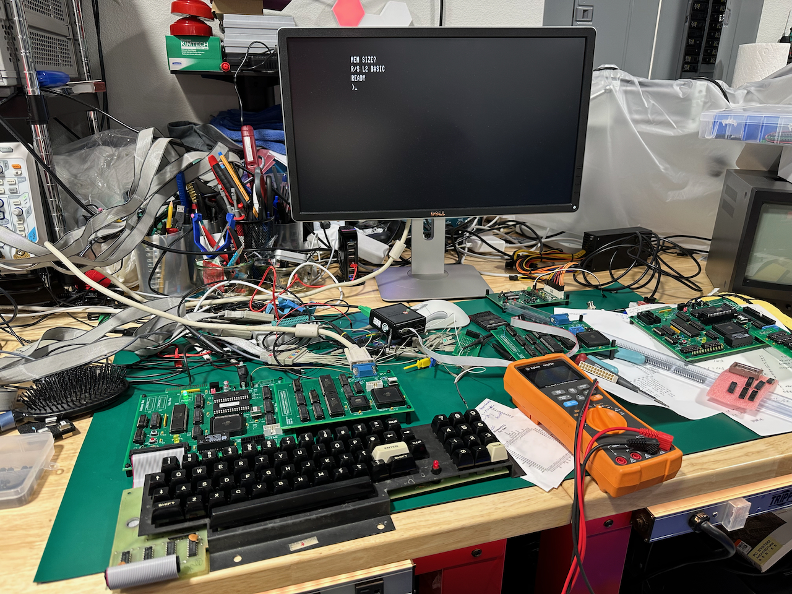

# supermodel1
## A replacement TRS-80 Model 1 Motherboard, with enhancements, buildable new in 2023.

This project is focused around building a replacement TRS-80 Model 1 motherboard using modern through-hole components available new in 2023.  This work will include the design and building of the motherboard PCB as well as the development of the CPLD code and the firmware to support both OEM and non-OEM ROM images.

This work is Open-Source, Open-Hardware, and free for anyone to use.

### Specifications:

+ Z80 CPU DIP 40, 1-16 MHz software adjustable based on installed oscillator. 

  - With a 28.332MHz oscillator you can get original spec 1.77Mhz operation, and multiples of that.
  - With a 32MHz oscillator you can get 1,2,4,8,16 Mhz operation.

+ 512K SRAM, bankable across all 4 16K regions, write protectable as well.

+ 512K FLASH, bankable across all 4 16K regions, write protectable as well. 

+ 16K of Video memory to support 64x16, 32x16, 80x24 text modes and 512x384 bitmap graphics modes.

+ No interference on video access from the CPU.  Video access from both CPU and video is full speed.

+ 256K of FONT RAM with direct CPU access to allow software fonts (8x16)

+ Compatible exeternal inteface port for original Tandy/RadioShack Expansion Interface

+ Cassette interface

+ Work with original keyboard

+ Video output: NTSC Composite B&W or VGA 640x480.

+ Onboard power regulation from DC input 7-36V.  Switching regulator, 94% efficient.  

### Status as of Oct 4, 2023:

We have completed the design and build of the first prototype PCBs.  The video section was built on a seperate PCB from the main CPU to allow for revisions to the video section if needed... and it turns out to not be an issue.  We were able to get both NTSC composite output and VGA output from the video interface.  

The first prototype PCB has been built and tested!  It works with the Level 2 R/S 1.3 ROMs allowing BASIC execution.  Next up will be testing with a few different variations of the EIs.

Once validation of all of the interconnects and compatibilty a new PCB will be build in the original case form factor.

On the current PCB power usage is about 2.6 watts running VGA output and an 8Mhz CPU.

(Authors:  Jeff Sponaugle, Neil Bradley)
